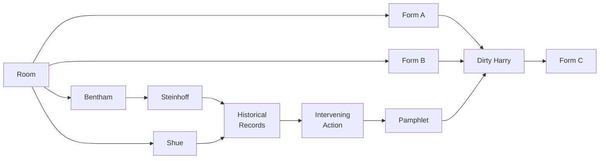

# Designing an Ethics Escape Room
Bringing a classic thought experiment to life
Vinesh Kannan

People working in social impact care about doing the “right” thing for their users, their fellow citizens, and their society. There is no shortage of policy and technology problems that contain messy ethical questions:

- Should users of a service be banned if their actions pose a threat to others?
- Is it permissible to conduct surveillance on innocent people if there is a chance that they will harm others?
- Are there decisions that should always be made by a human, never automatically?

For some pragmatic professionals, ethical discussions on these topics can be unappealing: it seems wasteful to sit around discussing philosophical puzzles. However, hundreds of thousands of Americans visit “escape rooms” each year, where they pay to spend hours playing puzzles. We wondered if we could use the escape room format to introduce players to ethical thinking.

The ethics escape room brings a classic thought experiment to life, challenging players to work in groups of three to four to gather clues from their surroundings, solve ethical puzzles, and decide what actions to take. The group has 60 minutes to complete the escape room, followed by a 30 minute discussion to reflect on the activity.

_Content Warning: The escape room explores the ethical debate around torture as an interrogational practice. The activity does not contain any graphic content, but the topic may be unsettling to some people._

Produced by Christina Qiu, Maria Gargiulo, Vinesh Kannan, and Zhi Keng He.

> Photo of a colored smoke bomb by Sara Kurfeß on Unsplash

Some of the most interesting ethical thought experiments have a bad reputation because their examples sound so contrived. Consider the “ticking time bomb” scenario:

> Authorities have apprehended someone who knows how to stop a bombing that will kill many people. Should the person be tortured to gain information to stop the attack?

The scenario is often used to pose a question along the lines of: is it okay to harm one individual to protect many? Some people protest that the scenario is based on unrealistic assumptions and that their answer would depend on the situation. These are valid criticisms that should be part of any answer to an ethical question.

The Markkula Center for Applied Ethics at Santa Clara University presents a framework for ethical decision making that has five parts:

1. Recognize an ethical issue
2. Get the facts
3. Evaluate alternative actions
4. Make a decision and test it
5. Act and reflect on the outcomes

In this framework, the “ticking time bomb” scenario is more like a mystery than a thought experiment. So, we designed an escape room to engage players in this famous scenario.

- Present players with an ethical decision to make under a time limit
- Introduce facts about the (fictional) scenario through clues
- Exercise ethical thinking through puzzles based on thought experiments

We tested the activity over three rounds of prototyping. In total, we ran six games, for 18 (admittedly) nerdy players. In addition to physical clues, we created a website where players could unlock digital clues, enabling us to quickly iterate on new content.

> Photo of players searching the room for more clues.

## The Scenario

The game master locks the players in the room and explains that they are staff in the Moral Defense Oversight Service (MDOS) (`/original/introduction.md`), a (fictional) organization in the Department of Homeland Security (DHS) that provides ethical guidance on matters of national security.

> “The room you are in is secure and full of documents that may be of interest. Unfortunately, we were informed too late of the scenario to organize briefing materials or decode documents.”

Players read the mission briefing (`/original/briefing.md`) and learn that DHS has apprehended an individual who claimed responsibility on social media for an impending bombing. Players find two proposed interrogation authorization forms (`/print/1_authorization_forms.pdf`): one permits “enhanced interrogation” and the other allows a psychologist to question the subject. The players have 60 minutes to decide which authorization form should be used and place it in a submission box.

## The Clues

A television screen displays a matrix (`/print/6_mdos_chart.pdf`) with two columns and three rows of questions:

1. Is enhanced interrogation justified if the threat may be fake?
2. Is enhanced interrogation justified even if it may not work?
3. Is enhanced interrogation justified if someone else performs it?

These questions introduce some dimensions of the debate and the columns hint at the existence of clues that relate to each question.

Searching the room further, they discover two clues. The first clue leads the players to a section in a paper by Henry Shue (`/original/shue.md`) that defines three types of victims of torture: the ready collaborator, the innocent bystander, and the dedicated enemy. Shue argues that it is practically impossible to determine which type a person is and treat them fairly. Yet, this is exactly what the players will have to do when they reach the historical records clue.




The second clue in the room supplies an email address and a worksheet with four five-point scales based on Bentham’s criteria (`/print/3_benthams_scale.pdf`), a utilitarian framework for measuring how much good or bad will come out of an action. Players send an email to the address and receive a response from a national security advisor (`/original/advisor.md`). Players use the scales to quantify the advisor’s assessment of the bomb threat according to its perceived intensity, duration, certainty, and nearness. It is challenging to agree on numerical values, but when the players correctly answer all four scales, the result unlocks the Steinhoff clue.

Uwe Steinhoff argues that torture could be morally permissible based on a person or a community’s right to self-defense. Players find a sheet that lists the definitions of four concepts (`/print/4_steinhoff_definitions.pdf`) that Steinhoff uses frequently: necessity, imminence, mildest means, and proportionality. When players unlock the Steinhoff clue, they discover four examples (`/original/steinhoff.md`) and match them to the correct concepts. Each example has a number and, when matched correctly, the numbers form the key to unlock the historical records clue.

Players read through five (fictional) historical records (`/original/records.md`) of enhanced interrogation and debate how Shue would classify each subject. Players count the number of ready collaborators, innocent bystanders, and dedicated enemies, forming a three-digit solution to unlock the intervening action clue. The game master eerily reminds the players that even if they came to the correct solution, they may still have misclassified some of the records.

> Photo of players searching for physical clues and decode digital clues on a laptop.

The next clue teaches the players the principle of intervening action:

> We are responsible for our actions, even if someone else caused us to act that way. We are not responsible for the consequences of actions taken by others because of us.

The clue contains three statements (`/original/intervening.md`). In each case, national security officials claim or disclaim responsibility for a certain outcome. Players decide which statements are supported by the principle of intervening action. When they join the two-digit numbers attached to those statements, they unlock the pamphlet clue.

The pamphlet clue (`/original/pamphlet.md`) provides background on the values and justifications of the organization that the bomber belongs to. Players combine this information with the ideas of Shue and Steinhoff to decide what kinds of actions might be morally permissible in this scenario.

If, at any point, the players appear close to a consensus on one of the two authorization forms, the game master will share the Dirty Harry clue.

A Dirty Harry scenario occurs when (1) a normally lawful person believes the only way for them to carry out (2) their legal mandate is to (3) take an action that is not morally permissible.

Players write an imaginary story (`/print/5_dirty_harry.pdf`) where such a scenario emerges based on their chosen authorization form. If their story does not correctly capture all three parts of a Dirty Harry scenario, the game master provides feedback and they try again. When completed satisfactorily, the game master reveals a third authorization form (`/print/2_custom_authorization_form.pdf`): one where players can write in any permissions and rules they want. The game master reminds the players to be wary of false choices: when presented with only two options, there must be alternatives.

At the end of the hour, players deposit their chosen authorization form into the submission box and regroup for the debrief discussion with the designers.

## The Debrief

After the game, we asked the players questions including:

- Why did your group choose this authorization form?
- What information was missing that would have helped you decide?
- How well do you think your group handled the scenario?

We then asked the players to reflect on their performance using assessments based on two of the three main branches of ethics: virtue ethics and deontology. We struggled to design a utilitarian assessment because it was so difficult to quantify the good and bad consequences of every action the players might take.

Aristotle defines virtuous behavior as a mean between two extremes. We selected three “mean” virtues that we felt were important to this scenario: deliberation, passion, and justice.


```
      Excess         Cardinal Virtue (Mean)       Deficiency
<-- - - -o----------------------●----------------------o- - - -->
 Over-Cautiousness        Deliberation           Recklessness

<-- - - -o----------------------●----------------------o- - - -->
       Zeal                  Passion                Apathy

<-- - - -o----------------------●----------------------o- - - -->
     Leniency                Justice              Maleficence
```

_Three virtues for players in this scenario: an excess of deliberation is over-cautiousness while a deficiency is recklessness; an excess of passion is zeal while a deficiency is apathy; and an excess of justice is lenience while a deficiency is maleficence._

Some groups shared that they postponed debating the first two authorization forms until the end of the challenge, showing an excess of deliberation. Others tried to brute force lock combinations based on partial answers to ethics puzzles, showing a deficiency of deliberation.

> Photo of players discussing how Shue would classify each of the torture victims in the historical records.

Deontology is the study of duties that people must follow and rights that people may exercise. We created a deontological definition of good and bad for this scenario by writing four basic rules. As in the real world, these rules were not obviously stated to the players, but the clues alluded to these rights and duties.

Players can exercise two rights:

- **Self-Defense:** May take actions to protect civilians from ongoing attacks.
- **Justice:** May take actions to fix an unfair distribution of pain or pleasure.
Players must follow two duties:

- **Harm Prevention:** May not take actions that harm innocent people.
- **Fidelity:** May not take actions that violate promises or deceive people.

**Spoilers in this paragraph:** At this point, we revealed (`/original/truth.md`) an important detail that the players could not have learned from the clues: the person apprehended by authorities was not the actual bomber, despite their claim on social media. They claimed responsibility to try and protect the actual bomber, their father, follow their values from the pamphlet clue. In the eyes of the law, the person being interrogated could be considered guilty as an accessory, but the ethical decision to conduct enhanced interrogation is not as clear. Players questioned the moral duties and debated whether or not they acted within their moral rights.

## The Feedback

It was exciting to watch the players’ curiosity and frustration during the challenge and to be able to discuss the scenario together after each game. Here is a sampling of their feedback:

> “It was lots of fun. I liked cracking the codes, the readings were interesting, and the clues turned out to be good reading comprehension checks.”

> “The scenario was good. There was a sense of urgency and it was like we were forming the story as we found the clues.”

> “Even though we learned new ethics topics, when the discussion started, we were still inputting our own morals and values into our opinions and justifications.”

> “Decisions didn’t feel immediate. There were lots of papers and examples of philosophies, but there were no consequences. It was all to get to the next document or letter, which doesn’t feel real.”

The ethics escape room is frustrating because, unlike a normal escape room, there is no clear signal of success or failure. Still, role-playing games provide practice for two important skills:

- Identifying important details that shape the ethical context of a scenario
- Testing alternatives with thought experiments before taking action
If you would like to run this ethics escape room, the materials are on GitHub.

This activity was designed by Christina Qiu, Maria Gargiulo, Vinesh Kannan, and Zhi Keng He. Thank you to Coding It Forward and all the players who tested the game!
